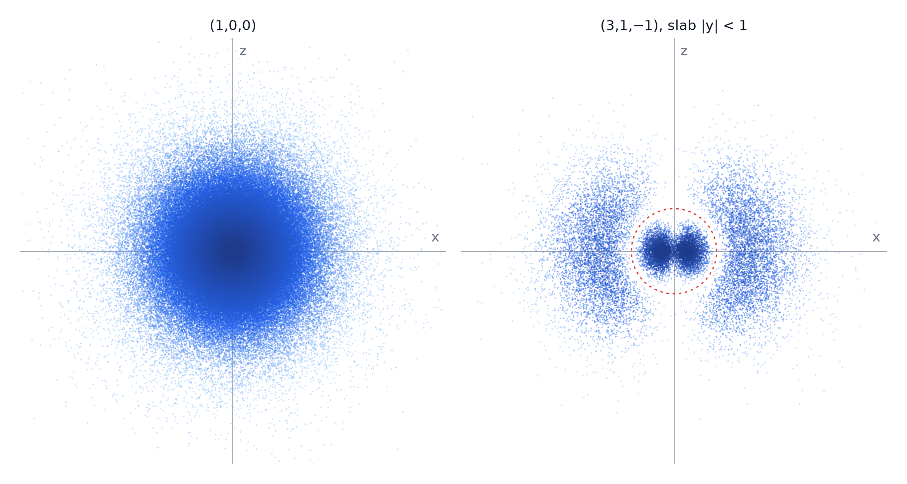
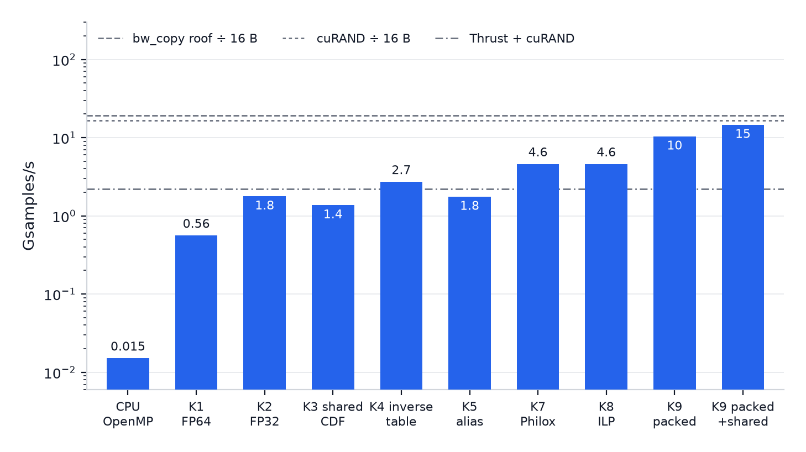
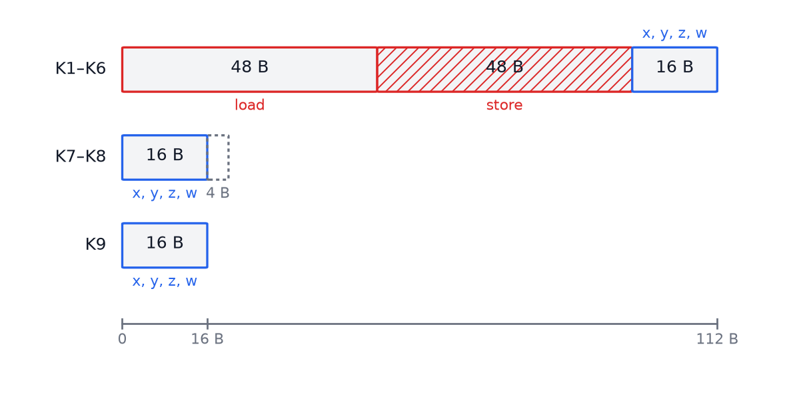

# Optimizing quantum compute on CUDA

Code, measurements and profiler reports for the article **Optimizing quantum compute on CUDA, Act I: sampling a hydrogen orbital at the bandwidth roof**. The article is still being written and will be linked here when it is out. Parts 2 and 3 will get their own branches in this repo.

The problem: given the quantum numbers (n, l, m) of a hydrogen orbital, draw millions of positions distributed exactly the way the electron would be found, each with its density. It is a tiny amount of maths per sample and it is one of the most bandwidth bound things I have written. The climb goes from a CPU loop to a kernel that sits at 77% of the card's measured write roof.

<p align="center">
  
</p>

## The result first

RTX 2070 Super Max-Q, SM clock locked at 1500 MHz, 8 million samples of the ground state, median of 20 runs after 3 warmups. The roof is the measured 305 GB/s copy bandwidth divided by the 16 bytes of `{x, y, z, w}` each sample writes.

| Kernel | What changed | Gsamples/s | GB/s of payload | % of roof |
|---|---|---|---|---|
| CPU, 16 threads | corrected FP64 reference, OpenMP | 0.015 | 0.24 | 0.08% |
| K1 | thread per sample, FP64, binary search on a CDF, cuRAND XORWOW | 0.56 | 9 | 2.9% |
| K2 | same, FP32 | 1.78 | 28 | 9.3% |
| K3 | CDF in shared memory | 1.37 | 22 | 7.2% |
| K4 | inverse CDF table, O(1) lookup and lerp | 2.72 | 44 | 14% |
| K5 | Walker/Vose alias tables (node proof) | 1.76 | 28 | 9.2% |
| K6 | float4 output, fused vs split pipeline | 1.76 / 1.51 | 28 / 24 | 9.2% |
| K7 | stateless Philox: delete the RNG state | 4.60 | 74 | 24% |
| K8 | grid stride and samples per thread ILP sweep | 4.59 | 73 | 24% |
| K9 | aligned 8 byte alias records | 10.39 | 166 | 54% |
| K9 + shared | draw arrays staged in shared memory | **14.60** | **234** | **77%** |

<p align="center">
  
</p>

The short version of why: for the first six kernels the random number state is 96 of the 112 bytes each sample moves through DRAM, and none of those bytes are the answer. Everything before K7 is rearranging the other 16.

<p align="center">
  
</p>

## How I worked

Every step follows the same loop, and the repo is laid out so you can see it.

1. **Predict before writing.** Each part opens with a `HYPOTHESIS.md`: a claimed number, the arithmetic behind it against measured referees (not spec sheet numbers), and a line below which the prediction counts as falsified.
2. **Write the kernel.** Device code is split into small inline functions so the pieces can be tested on their own, and the `__global__` function mostly packs data.
3. **Verify before measuring.** A CPU FP64 reference and a statistical gate: moments against the closed forms, Kolmogorov Smirnov and chi square on the marginals, a fine window over the radial node of (3,1,-1) that catches the bug the inverse table introduces, and bit exact determinism across launch geometries. `verify-full` writes a gate file and the benchmark refuses to emit official JSON without it.
4. **Measure with the clock locked**, through `scripts/bench.sh`, into `results/*.json` with the environment captured.
5. **Read the profiler.** Nsight Compute and Nsight Systems reports are committed under `results/nsight/` with a `reading.md` quote sheet, so the stall names in the article are traceable.
6. **Retro.** `RETRO.md` states what the model got right and what it got wrong, with the ratio of measured to predicted. Several predictions missed, some by a lot, and those misses are the article.

The rough shape of the exploration: the CPU reference first, because the common implementation of this sampler has three quiet bugs and I wanted an oracle before touching the GPU. Then the straight port (K1, K2), which was faster than I priced because the tables live in L2, not DRAM. Shared memory for the search (K3) lost, because a dependent chain of loads does not care which SRAM it chains through. The inverse table (K4) landed exactly on the XORWOW bandwidth ceiling I had itemised, and also broke the radial node, which is what forced the alias method (K5, K6). Only then did the 48 byte RNG state become the obvious target (K7, K8), and shrinking the alias record to 8 bytes with the draw arrays in shared memory (K9) is where the 3.2x over K7 comes from.

## Branches

Each branch is the repo as it stood at that step. The article quotes code as `path:lines @ branch`.

| Branch | Kernels | Part directory |
|---|---|---|
| `setup` | harness only | |
| `cpu-baseline` | CPU reference, referees (copy, FMA, cuRAND) | `parts/cpu-baseline` |
| `naive-cuda` | K1, K2 | `parts/naive-cuda` |
| `inverse-table` | K3, K4 | `parts/inverse-table` |
| `alias-method` | K5, K6 | `parts/alias-method` |
| `endgame` | K7, K8, Thrust referee | `parts/endgame` |
| `packed-records` | K9, orbital and layout sweeps | `parts/packed-records` |
| `main` | everything, plus this README | |

## Layout

```
main.cpp                    CLI: stats-smoke, verify-fast, verify-full, microbench,
                            cpu-bench, naive-bench, inverse-bench, alias-bench,
                            endgame-bench, packed-bench, packed-orbitals, packed-layout, packed-churn
harness/                    shared plumbing: device memory, timing, results JSON, env capture,
                            verify gate, KS / chi2 / moments, CPU Philox, sample dump
cpu-reference/              corrected FP64 hydrogen sampler, the original buggy one, goldens
parts/<part>/
  HYPOTHESIS.md             prediction and falsification line, written first
  RETRO.md                  what was right, what was wrong, written last
  src/                      kernels and the host side bench
  verify/                   the statistical gate for this part
  experiments/              one off probes and their JSON (occupancy, node trap, layouts)
  results/                  official JSON per kernel, plus results/nsight/ with ncu and nsys reports
  refs/                     sources I leaned on
scripts/bench.sh            refuses to run official numbers without the SM clock lock
scripts/plot/               throughput plots
docs/figures/               a few of the article figures
```

## Building and running

CUDA toolkit with `nvcc`, CMake 4.3 or newer, a C++23 compiler, OpenMP. Architecture is set to `sm_75` in `CMakeLists.txt`; change `CMAKE_CUDA_ARCHITECTURES` for another card. CLI11, {fmt} and nlohmann/json are fetched on configure.

```bash
cmake -B build -DCMAKE_BUILD_TYPE=Release -DQMC_LINEINFO=ON
cmake --build build -j

./build/cuda_qmc_exploration verify-fast          # goldens, bug hunt, 1e5 samples
./build/cuda_qmc_exploration verify-full          # 1e7 sample matrix, writes the gate
scripts/bench.sh ./build/cuda_qmc_exploration packed-bench --kernel packed_shared --official
```

`scripts/bench.sh` checks `nvidia-smi` for the locked clock and exits if it is not there. Pass `--allow-unlocked` for smoke runs only; those numbers are not comparable to anything in `results/`.

## Hardware the numbers were taken on

RTX 2070 Super Max-Q (Turing, 4 MiB L2), Intel i7-10875H, Linux. Measured referees at the locked clock: copy bandwidth 305 GB/s, FP32 3.75 T FMA/s, FP64 88.2 G FMA/s, cuRAND Philox 264 GB/s of raw bits. Every number in the tables above comes from a JSON under `parts/*/results/`.
